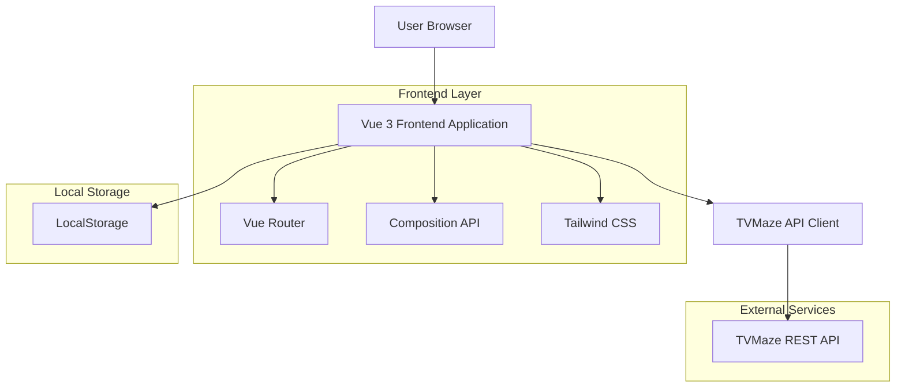
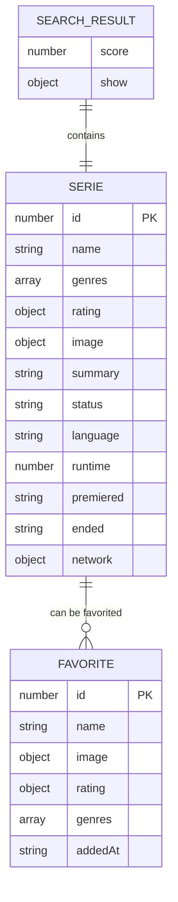

# Documentación de Arquitectura Técnica - TVApi Series

## 1. Architecture design



## 2. Technology Description

- **Frontend**: Vue@3 + Vue Router@4 + Tailwind CSS@3 + Vite@5
- **Backend**: None (Frontend-only application)
- **API**: TVMaze REST API (External service)
- **Storage**: LocalStorage (for favorites functionality)

## 3. Route definitions

| Route | Purpose |
|-------|---------|
| / | Página principal con búsqueda de series y resultados |
| /serie/:id | Página de detalles de una serie específica |
| /favoritos | Página opcional para mostrar series marcadas como favoritas |

## 4. API definitions

### 4.1 Core API Integration

**TVMaze API Endpoints utilizados:**

**Búsqueda de series**
```
GET https://api.tvmaze.com/search/shows?q={query}
```

Response Structure:
| Param Name | Param Type | Description |
|------------|------------|-------------|
| score | number | Relevancia del resultado (0-1) |
| show | object | Objeto con información de la serie |
| show.id | number | ID único de la serie |
| show.name | string | Nombre de la serie |
| show.genres | array | Array de géneros |
| show.rating | object | Objeto con rating promedio |
| show.image | object | URLs de imágenes (medium, original) |
| show.summary | string | Sinopsis en HTML |

**Detalles de serie específica**
```
GET https://api.tvmaze.com/shows/{id}
```

Response Structure:
| Param Name | Param Type | Description |
|------------|------------|-------------|
| id | number | ID único de la serie |
| name | string | Nombre de la serie |
| genres | array | Géneros de la serie |
| status | string | Estado (Running, Ended, etc.) |
| runtime | number | Duración por episodio en minutos |
| premiered | string | Fecha de estreno |
| ended | string | Fecha de finalización |
| rating | object | Rating promedio |
| image | object | URLs de imágenes |
| summary | string | Sinopsis completa |
| language | string | Idioma original |
| network | object | Información de la cadena |

### 4.2 LocalStorage Schema

**Estructura para favoritos:**
```javascript
// Clave: 'tvapi-favorites'
// Valor: Array de objetos serie
[
  {
    id: number,
    name: string,
    image: object,
    rating: object,
    genres: array,
    addedAt: string (ISO date)
  }
]
```

## 5. Data model

### 5.1 Data model definition



### 5.2 Component Architecture

**Estructura de componentes Vue:**

```
src/
├── components/
│   ├── common/
│   │   ├── LoadingSpinner.vue     # Spinner de carga reutilizable
│   │   ├── ErrorMessage.vue       # Componente para mostrar errores
│   │   └── EmptyState.vue         # Estado vacío cuando no hay resultados
│   ├── search/
│   │   ├── SearchBar.vue          # Barra de búsqueda principal
│   │   └── SearchResults.vue      # Container de resultados
│   ├── series/
│   │   ├── SerieCard.vue          # Tarjeta individual de serie
│   │   ├── SerieDetail.vue        # Vista detallada de serie
│   │   └── SerieHero.vue          # Hero section para detalles
│   └── layout/
│       ├── AppHeader.vue          # Header principal
│       └── AppLayout.vue          # Layout base
├── views/
│   ├── HomeView.vue               # Página principal
│   ├── SerieDetailView.vue        # Página de detalles
│   └── FavoritesView.vue          # Página de favoritos (opcional)
├── composables/
│   ├── useApi.js                  # Lógica para llamadas a API
│   ├── useFavorites.js            # Manejo de favoritos
│   └── useSearch.js               # Lógica de búsqueda
├── utils/
│   ├── api.js                     # Cliente HTTP para TVMaze API
│   ├── formatters.js              # Funciones de formato de datos
│   └── constants.js               # Constantes de la aplicación
└── assets/
    ├── css/
    │   └── main.css               # Estilos base y Tailwind
    └── images/
        └── placeholder.jpg        # Imagen placeholder
```

### 5.3 State Management Strategy

**Usando Composition API sin Vuex/Pinia:**

```javascript
// Reactive state management
const globalState = reactive({
  searchQuery: '',
  searchResults: [],
  isLoading: false,
  error: null,
  favorites: []
})

// Composables para encapsular lógica
const useSearch = () => {
  // Lógica de búsqueda
}

const useFavorites = () => {
  // Lógica de favoritos
}

const useApi = () => {
  // Lógica de API calls
}
```

### 5.4 Performance Optimizations

**Estrategias implementadas:**

1. **Lazy Loading**: Carga diferida de imágenes con Intersection Observer
2. **Debouncing**: Retraso en búsquedas para evitar llamadas excesivas
3. **Caching**: Cache simple de resultados en memoria
4. **Image Optimization**: Uso de imágenes medium de TVMaze para mejor rendimiento
5. **Component Splitting**: Componentes pequeños y reutilizables
6. **Virtual Scrolling**: Para listas largas de resultados (opcional)

### 5.5 Error Handling Strategy

**Manejo de errores en múltiples niveles:**

```javascript
// API Level
const handleApiError = (error) => {
  if (error.response?.status === 404) {
    return 'Serie no encontrada'
  }
  if (error.response?.status >= 500) {
    return 'Error del servidor. Intenta más tarde.'
  }
  return 'Error de conexión. Verifica tu internet.'
}

// Component Level
const errorState = ref(null)
const showError = (message) => {
  errorState.value = message
  setTimeout(() => errorState.value = null, 5000)
}
```