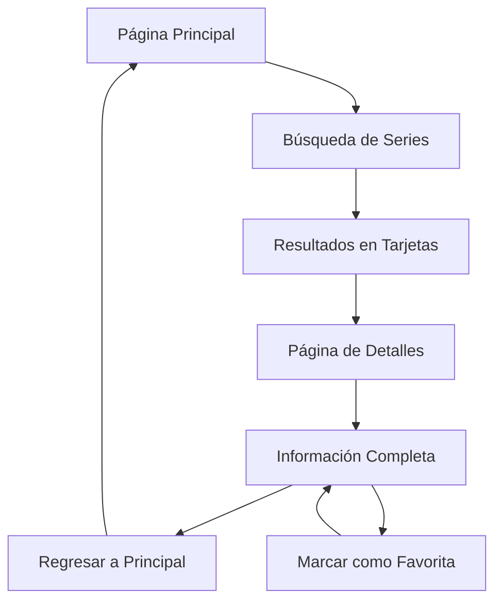

# Documentación de Requisitos - TVApi Series

## 1. Product Overview

Una aplicación web moderna de catálogo de series de televisión que permite a los usuarios buscar, explorar y obtener información detallada sobre sus series favoritas, utilizando la API gratuita de TVMaze.

La aplicación resuelve la necesidad de tener acceso rápido y organizado a información completa sobre series de televisión, dirigida a entusiastas del entretenimiento que buscan descubrir nuevas series o obtener detalles específicos sobre sus programas favoritos.

El objetivo es crear una plataforma intuitiva y visualmente atractiva que compita con las interfaces modernas de streaming como Netflix o HBO Max.

## 2. Core Features

### 2.1 User Roles

No se requiere distinción de roles de usuario. La aplicación es de acceso público sin necesidad de registro o autenticación.

### 2.2 Feature Module

Nuestra aplicación de series de televisión consta de las siguientes páginas principales:

1. **Página Principal**: barra de búsqueda, resultados de series, navegación principal.
2. **Página de Detalles**: información completa de la serie, botón de regreso, datos técnicos.

### 2.3 Page Details

| Page Name | Module Name | Feature description |
|-----------|-------------|---------------------|
| Página Principal | Barra de Búsqueda | Permite buscar series por nombre utilizando el endpoint /search/shows?q= de TVMaze. Incluye validación de entrada y manejo de estados de carga. |
| Página Principal | Grid de Resultados | Muestra las series encontradas en formato de tarjetas con imagen, nombre, géneros, calificación y enlace a detalles. Diseño responsive tipo catálogo. |
| Página Principal | Navegación | Header con logo y título de la aplicación. Navegación limpia y moderna. |
| Página Principal | Manejo de Estados | Gestiona estados de carga, error y resultados vacíos con mensajes informativos en español. |
| Página de Detalles | Información Principal | Muestra imagen destacada, título, sinopsis completa, géneros, idioma original y puntuación de la serie. |
| Página de Detalles | Datos Técnicos | Presenta número de temporadas, episodios totales, estado de la serie y fechas relevantes. |
| Página de Detalles | Navegación | Botón de regreso a la página principal y breadcrumbs para mejor UX. |
| Página de Detalles | Favoritos (Opcional) | Permite marcar/desmarcar series como favoritas usando localStorage. |

## 3. Core Process

**Flujo Principal del Usuario:**

1. El usuario accede a la página principal donde ve la barra de búsqueda prominente
2. Introduce el nombre de una serie en el campo de búsqueda
3. La aplicación realiza una petición a la API de TVMaze y muestra los resultados en formato de tarjetas
4. El usuario puede hacer clic en cualquier tarjeta para ver los detalles completos de la serie
5. En la página de detalles, puede ver toda la información y regresar a la búsqueda principal
6. Opcionalmente, puede marcar series como favoritas para acceso rápido

## 4. User Interface Design

### 4.1 Design Style

**Colores Principales:**
- Primario: #1a1a1a (Negro profundo para fondos)
- Secundario: #e50914 (Rojo Netflix para acentos)
- Terciario: #ffffff (Blanco para textos)
- Gris: #333333 (Para elementos secundarios)

**Estilo de Botones:**
- Botones redondeados con esquinas suaves (rounded-lg)
- Efectos hover con transiciones suaves
- Botones principales con gradientes sutiles

**Tipografía:**
- Fuente principal: Inter o system fonts
- Títulos: 24px-32px, peso 700
- Subtítulos: 18px-20px, peso 600
- Texto normal: 14px-16px, peso 400

**Layout:**
- Diseño tipo grid responsive
- Cards con sombras sutiles y efectos hover
- Navegación superior fija
- Espaciado generoso entre elementos

**Iconos y Elementos:**
- Iconos minimalistas tipo Heroicons
- Emojis para ratings (⭐) y géneros
- Transiciones suaves en hover y carga

### 4.2 Page Design Overview

| Page Name | Module Name | UI Elements |
|-----------|-------------|-------------|
| Página Principal | Header | Fondo negro (#1a1a1a), logo centrado, título "TVApi Series" en blanco, altura fija 80px |
| Página Principal | Barra de Búsqueda | Input centrado con placeholder "Buscar series...", icono de búsqueda, fondo semi-transparente, bordes redondeados |
| Página Principal | Grid de Resultados | Grid responsive (1-2-3-4 columnas), cards con imagen 16:9, overlay con información, hover effects, sombras sutiles |
| Página Principal | Estados de Carga | Spinner animado, skeleton cards, mensajes de error con iconos, fondo oscuro consistente |
| Página de Detalles | Hero Section | Imagen de fondo con overlay, título grande en blanco, información básica superpuesta, gradiente de transparencia |
| Página de Detalles | Información | Layout de dos columnas, imagen a la izquierda, detalles a la derecha, tipografía jerárquica clara |
| Página de Detalles | Botones | Botón "Volver" con icono, botón "Favorito" con corazón, colores de acento rojo (#e50914) |

### 4.3 Responsiveness

La aplicación es **mobile-first** con adaptación completa a desktop:

- **Mobile (320px-768px)**: Layout de una columna, navegación simplificada, tarjetas apiladas
- **Tablet (768px-1024px)**: Grid de 2-3 columnas, elementos más espaciados
- **Desktop (1024px+)**: Grid de 4+ columnas, layout de dos columnas en detalles

Optimización táctil para dispositivos móviles con á